<p align="center">
  
</p>
<h1 align="center">Neon Video Studio</h1>
<p align="center">
  A desktop video editor you can drive by hand <em>or</em> by AI.<br>
  <b>Electrobun</b> (Bun main process + system WebView) · <b>Remotion</b> (React compositions for preview <em>and</em> export) · <b>Yjs</b> (CRDT project state, peer‑to‑peer over WebRTC / LAN — no cloud)
</p>

<p align="center">
  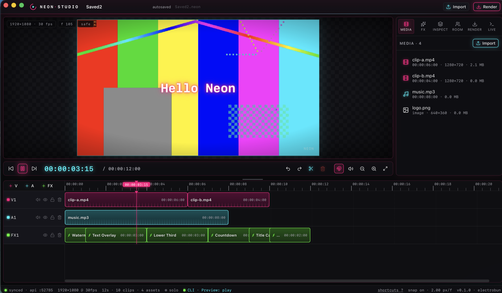
</p>

## Why

I wanted one tool to cut client videos without bouncing between apps — and one that an AI agent can
operate end to end. Every action in the UI is also a CLI command (`neon-cli`) and an HTTP call, and
everything the CLI does shows up live in the app (Live panel, clip flashes, status pulse), so you can
watch an agent edit while you keep control of the timeline.

## Highlights

- **Timeline editing** — video / audio / FX tracks, drag, trim, snap, ripple insert, split at playhead, undo/redo (only your own edits), keyboard shortcuts (`?`)
- **React templates as clips** — TextOverlay, LowerThird, TitleCard, Countdown, ProgressBar, Watermark, SolidColor; props edited in the inspector, validated with zod, rendered identically in preview and export
- **Export** — H.264 MP4 through `@remotion/renderer` on the app's own bundled Bun runtime (no Node required at runtime); presets from draft to 4K, vertical and square
- **Agent/CLI control** — `neon-cli` covers projects, media, timeline, tracks, render, rooms, preview transport and a live event stream; `--json` everywhere
- **P2P collaboration** — host a room, others on the LAN join by code (UDP discovery, no server); Yjs CRDT keeps everyone converged, peers' playheads are visible, assets replicate by SHA‑256
- **Local‑first** — projects are folders (`project.json` + CRDT state + content‑addressed assets); autosave; nothing leaves your machine

## Screenshots

| Playback with overlays | Live agent feed (every CLI action shows up here) |
|---|---|
|  | 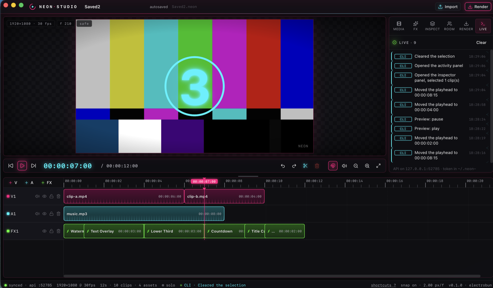 |

| Inspector (schema‑driven template props) | Countdown template over a clip |
|---|---|
| 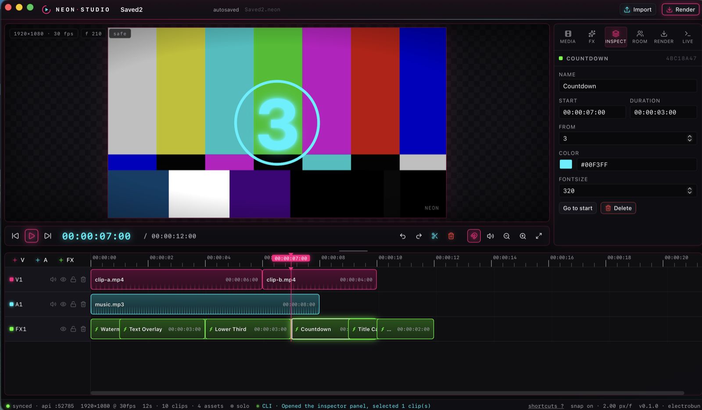 | 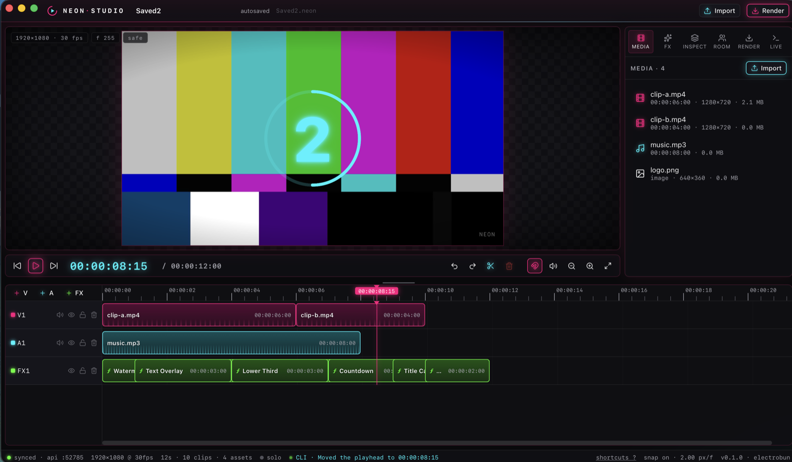 |

| Frame from an exported MP4 (LowerThird template) |
|---|
| 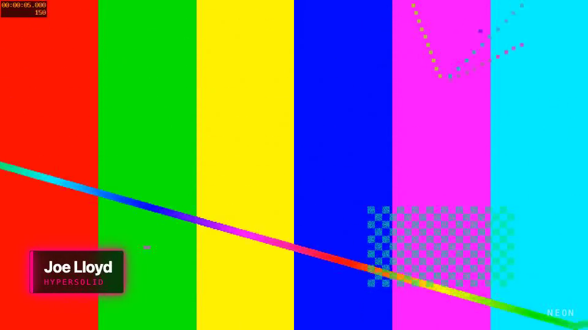 |

## Install (macOS)

Releases are built by CI for macOS (arm64/x64), Windows and Linux. The mac build is unsigned, so the
install script clears the Gatekeeper quarantine flag and ad‑hoc signs the bundle:

```bash
curl -fsSL https://raw.githubusercontent.com/joe-lloyd/neon-video-studio/main/scripts/install-mac.sh | bash
```

or from a local checkout: `pnpm --filter @neon/desktop build:app && scripts/install-mac.sh --local`.

## Develop

Requirements: Node ≥ 22.18 (24 used), pnpm ≥ 10.16, `ffmpeg`/`ffprobe` on PATH, macOS for the
`electrobun` toolchain download on first run.

```bash
pnpm install --ignore-scripts       # 7-day minimumReleaseAge enforced in pnpm-workspace.yaml
pnpm dev                            # electrobun prepare → vite build → launch the app
pnpm dev:renderer                   # optional: Vite HMR on :5173 (the app picks it up automatically)
pnpm test && pnpm typecheck
scripts/smoke.sh                    # e2e against the running app: import → insert → render
```

```
neon-video-editor/
├── apps/desktop/            Electrobun app · src/main (Bun) · src/renderer (React 19 + Vite)
├── apps/cli/                neon-cli
├── apps/remotion-workspace/ Timeline composition + templates
├── packages/core/           Domain model, Yjs ProjectDoc, timecode, schemas, API protocol
├── packages/p2p/            Sync + signaling servers, LAN discovery, browser PeerSession
├── packages/render/         Remotion render worker + headless renders
├── packages/icon-kit/       Neon icons + logo
└── scripts/                 smoke test · release · install-mac · build-icons
```

## Integrated AI (local-first)

Everything runs on local engines — whisper.cpp for speech, ffmpeg's neural RNNoise for audio,
Apple Vision for people and faces. Nothing leaves your machine (the only optional cloud call is
Claude picking B-roll concepts when `ANTHROPIC_API_KEY` is set). Every feature is a button in the
**AI** panel *and* a CLI command, and every change lands on the timeline as normal, undoable edits.

| Feature | How | Engine |
|---|---|---|
| Filler-word removal (*um, uh, like, you know*) | finds them in the word-level transcript, cuts video+audio with micro-crossfades, ripples the timeline | whisper.cpp |
| Smart silence trimming | pauses > 400 ms are shortened to a natural 150 ms | energy VAD (built-in) |
| Breath & mouth-noise softening | −15 dB volume keyframes over detected breaths (no jarring cuts) | energy heuristic |
| Neural denoise | new cleaned asset, original kept; clip swaps automatically | RNNoise / afftdn / DeepFilterNet |
| Background removal | person segmentation → ProRes 4444 with alpha (no green screen); chroma-key mode too | Apple Vision |
| Auto-reframe 16:9 → 9:16 | face tracking with smoothing steers the crop; optional project resize | Apple Vision |
| B-roll suggestions | transcript concepts matched to your media library, placed on B-ROLL tracks | heuristic + optional Claude |
| Text-driven editing | **Script** panel: click a word to jump, select words and hit ⌫ to cut them from the video | whisper.cpp |

```bash
pnpm cli ai status                       # which engines are ready + install hints
pnpm cli ai clean talk.mp4               # fillers + silences + breaths in one go
pnpm cli ai fillers talk.mp4 --apply
pnpm cli ai matte talk.mp4 --mode person
pnpm cli ai reframe talk.mp4 --aspect 9:16 --resize
pnpm cli ai broll --apply
pnpm cli ai transcript talk.mp4          # word indexes …
pnpm cli ai cut talk.mp4 33 35           # … delete “stay calm and” from the video
```

First-time setup: `brew install whisper-cpp` plus a model download (the app prints the exact
commands in **AI → engines** / `ai status`). The Vision helper compiles itself on first use.

| AI panel | Script panel (text-driven editing) |
|---|---|
| 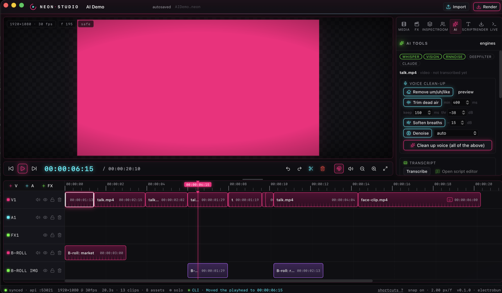 | 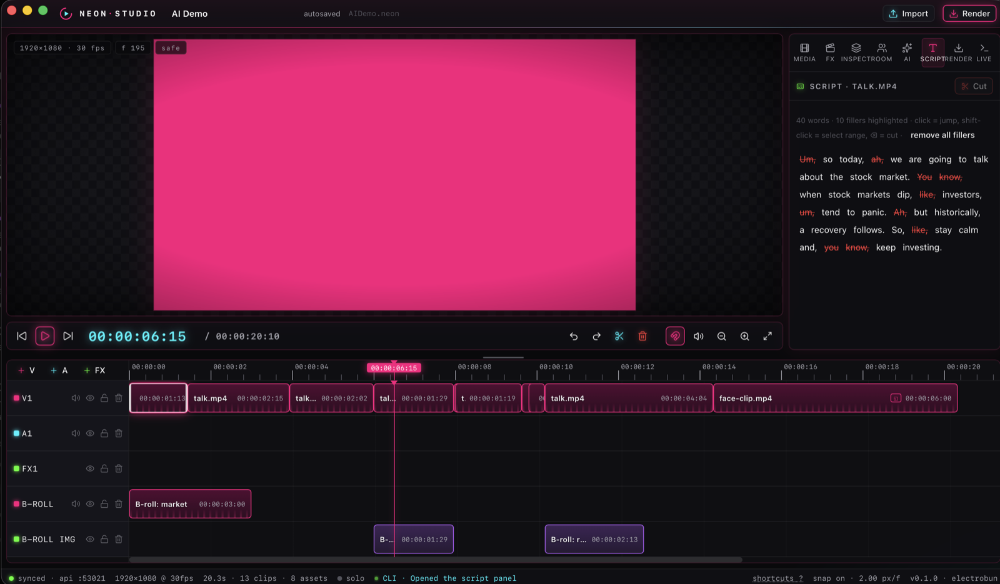 |

| Background removal on real footage (Apple Vision person matte) |
|---|
| 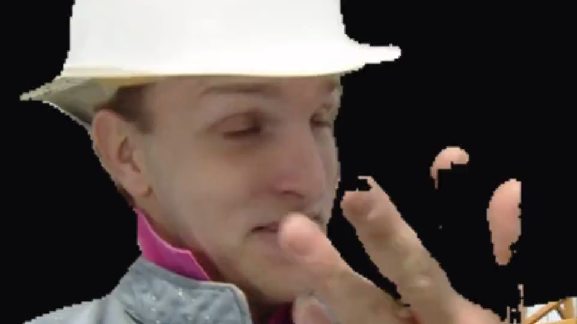 |

## Docs

- **[CLI reference](docs/cli.md)** — every command with examples and agent recipes
- **[FX packs](docs/fx-packs.md)** — build your own animated React components (any npm library works)
- **[Feedback log](FEEDBACK.md)** — running list of requests and their status

## Drive it from the terminal (or from an AI)

```bash
pnpm cli status
pnpm cli list                                      # templates (with JSON Schema), tracks, clips, assets, presets
pnpm cli assets import ./intro.mp4 --at 0
pnpm cli timeline insert --component TextOverlay --props '{"text":"Hello World"}' --at 00:00:02:15
pnpm cli timeline split <clip> --at 4s
pnpm cli preview seek 2s && pnpm cli preview play  # watch it in the app
pnpm cli events                                    # tail everything the app does, live
pnpm cli render --output ./renders/export.mp4 --preset 1080p60
pnpm cli render --headless --project ./MyProject.neon --output out.mp4
pnpm cli room host  ·  pnpm cli room join K7PM-2XQD-9HRT
```

The CLI finds the app through `~/.neon-video/instance.json` (loopback port + bearer token). Add
`--json` for `{ok, data | error}` output. `neon-cli list --json` returns every template's JSON
Schema and defaults so an agent can discover valid props before inserting.

## Releases

```bash
scripts/release.sh 0.2.0     # bumps versions, commits, tags v0.2.0
git push --follow-tags       # CI builds mac/win/linux and publishes a GitHub release
```

## App icon

Five candidates live in `apps/desktop/icons/candidates/`; regenerate all platform icons from one with
`scripts/build-icons.sh <nn>` (currently `01`).

| 01 ring‑play | 02 neon‑n | 03 timeline | 04 gradient‑play | 05 prism |
|---|---|---|---|---|
| 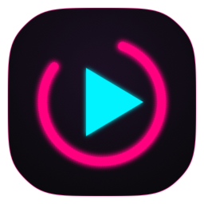 | 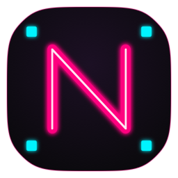 | 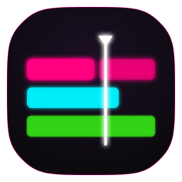 | 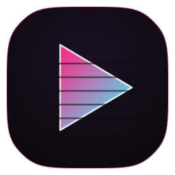 | 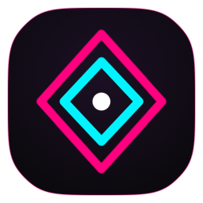 |

## Architecture in one paragraph

The Bun main process owns the project (`ProjectDoc`, a typed façade over a `Y.Doc`) and persists it
to `<name>.neon/{project.json,doc.bin,assets/}`. It serves a loopback control API (`/api/*`, bearer
token, SSE event stream), a y‑websocket‑compatible sync endpoint (`/yjs`) the React renderer
connects to, a content‑addressed asset server (`/assets/<sha256>`, HTTP ranges) and — while hosting a
room — a second LAN listener with the same sync/asset endpoints plus a y‑webrtc signaling relay,
advertised over UDP multicast. The renderer previews with `@remotion/player`; exports spawn a worker
on the app's bundled Bun that runs `@remotion/renderer` against the same `TimelineComposition`, so
preview and export cannot diverge.

## Notes / known quirks

- Remotion's licence terms apply to your use case; this repo is a personal tool.
- WKWebView can take a couple of seconds to paint a **paused** video frame after a seek (it paints immediately during playback). Overlays are unaffected.
- Not yet verified: WebRTC between two physical machines (LAN WebSocket fallback is), Windows/Linux builds beyond CI wiring.
